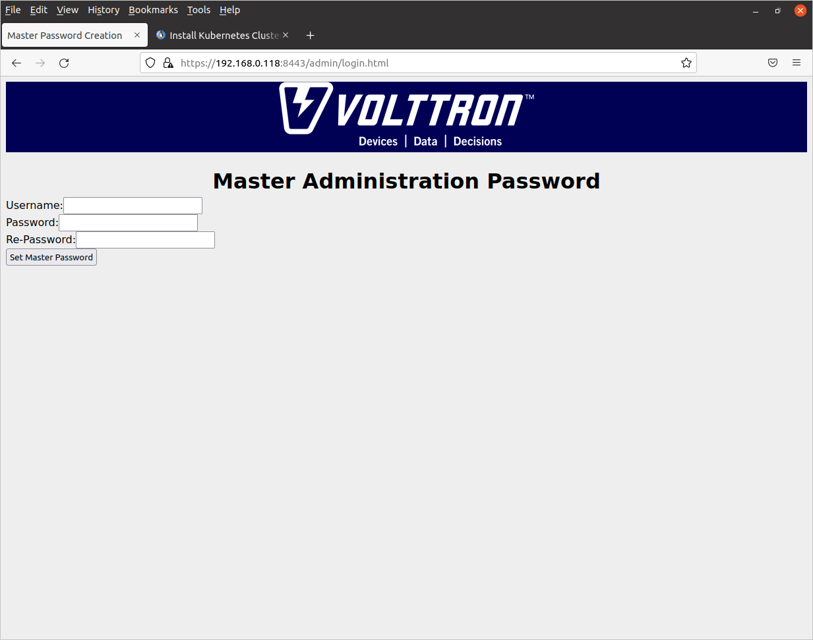
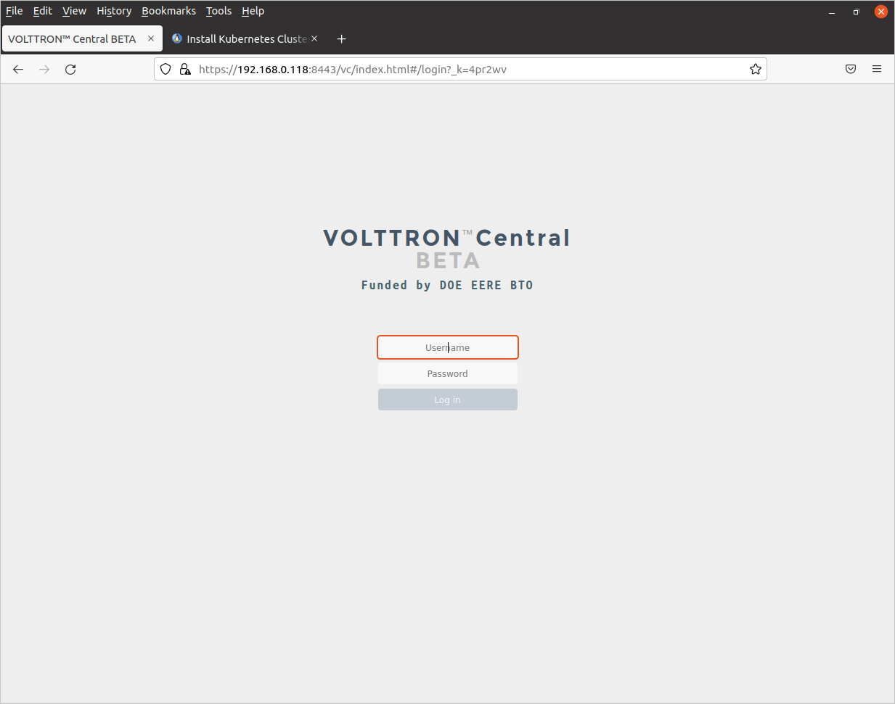

# Deploying Volttron Central on the central node.

The instructions below assume that you have configured a cluster following the
directions in `cluster-config/README.md`. The instructions will walk 
you through the steps needed to deploy the `vcentral` microservice in 
your central node VM. 

## Vcentral manifests

### Vcentral service manifests

The `vcentral` services manifests are contained in the following three yaml files: 

- `vcentral-deploy.yml`: This sets up a Kubernetes Deployment for a vcentral Volttron Central microservice with an 
SQL Lite historian mounted to the VM's file system so the data survives the
container going down. The deployment has only one replica pod. The Kubernetes Deployment restarts the pod if it crashes. 
You need to edit the file and replace the value of the 
`kubernetes.io/hostname` key which is`central-node` 
with the hostname of your central node.

- `vcentral-service.yml`: This defines a NodePort type service for the `vcentral` HTTP service at
port 8443 and the VIP bus service at port number 22916 so the gateway pods can connect to
the VIP bus (individual pods in a Kubernetes cluster have no access to a common Unix
socket which is how agents typically communicate on the VIP bus). The Nginx reverse proxy
forwards HTTP requests on port 80 of the global DNS name for the VM (if you are running
`central-node` in a cloud) or the VM address (if you are running in a local VirtualBox
VM). 

### Vcentral storage manifest

The `vcentral` storage manifest in the file `vcentral-storage.yml` defines three Kubernetes objects for mounting a local directory into the `vcentral` pod:

- StorageClass: This defines a type for a Kubernetes persistent volume. A `local` storage class is
used because we want to mount a local directory, and the class name is `local-storage`

- PersistentVolume: This type describes the path to the actual directory on the local node we 
want to mount. It also needs to specify what node the directory is on in the `nodeAffinity` section. 
Change the node name in the `matchExpressions:` `values:` section from
`central-node` to the hostname of your central node if you changed it. 
Note the `spec.persistentVolumeReclaimPolicy` is set to `Retain`
indicating that the volume should be retained if the pod goes down, and the `storageClassName` indicates the name of the StorageClass type of the persistent volume, in this case `local-storage`.

- PersistentVolumeClaim: This type allows a pod to exercise a claim on the PersistentVolume. 
It also indicates 
the `storageClassName`, again, `local-storage`. The `accessModes` 
array is set to `ReadWriteOnce` indicating that
only one pod at a time can read and write to the volume.

## Preparing the node for vcentral deployment

We use node labels to restrict the deployment of the `vcentral` microservice to the control node. `Kubeadm` adds a label
with the hostname, having key `kubernetes.io/hostname`. Check whether that label is present on the central node:

	kubectl get nodes --show-labels | grep <central node hostname>
	
If it isn't there, use the following command to add it:

	kubectl label nodes <central node hostname> kubernetes.io/hostname=<central node hostname>
	
We also need to create a local directory for the persistent volume 
on `central-node` that will hold the Historian database. 

	sudo mkdir -p /data/volttron/db
	
and change the permissions so anyone can read/write it:

	sudo chmod -R 777 /data/volttron/db
	
### Deploying the `vcentral` microservice with storage

Change to the `central-node` directory.

#### Deploying the persistent storage objects

The persistent storage objects are deployed with:

	kubectl apply -f vcentral-storage.yml

then check whether the objects have been created:

	kubectl get storageclass

which should show something like:

	NAME                     PROVISIONER                    RECLAIMPOLICY   VOLUMEBINDINGMODE      ALLOWVOLUMEEXPANSION   AGE
	volttron-local-storage   kubernetes.io/no-provisioner   Delete          WaitForFirstConsumer   false                  21m

Check for the PersistentVolume:

	kubectl get persistentVolume

which should show something like:

	NAME          CAPACITY   ACCESS MODES   RECLAIM POLICY   STATUS      CLAIM   STORAGECLASS             REASON   AGE
	vcentral-pv   500Mi      RWO            Retain           Available           volttron-local-storage            56s

Check for the PersistentVolumeClaim:

	kubectl get persistentVolumeClaim
	
which should show something like:

	NAME             STATUS    VOLUME   CAPACITY   ACCESS MODES   STORAGECLASS             AGE
	vcentral-claim   Pending                                      volttron-local-storage   69s

#### Deploying the `vcentral` service objects

The `vcentral` service objects are deployed with:

	kubectl apply -f vcentral-service.yml
	
and you can check whether they have been deployed with:

	kubectl get service

which should show something like:

	NAME         TYPE        CLUSTER-IP       EXTERNAL-IP   PORT(S)                          AGE
	kubernetes   ClusterIP   10.96.0.1        <none>        443/TCP                          23h
	vcentral     NodePort    10.110.166.233   <none>        8443:31776/TCP,22916:30777/TCP   15s
	
#### Deploying the `vcentral` deployment

Finally, we can create the `vcentral` deployment:

	kubectl apply -f vcentral-deploy.yml
	
We can watch the `vcentral` pod come up with:

	kubectl get --watch pods
	
which will follow progress on creating the pod:

	NAME                        READY   STATUS              RESTARTS   AGE
	vcentral-55f7968955-x54jq   0/1     ContainerCreating   0          26s
	vcentral-55f7968955-x54jq   1/1     Running             0          89s

#### Testing the Volttron Central microservice web site

Depending whether your `central-node` is running on a cloud or on a local
VM, there are two ways to check the Volttron Central web site.

##### `central-node` is running in a local VM

Type 
`https://<host IP address>:8443/index.html` into the address bar of
your browser running on the host where your central node VM is running. Your 
browser will bring up a page indicating that the certificate may be 
questionable, this is normal behavior because `vcentral` uses a self-signed
certificate. Click on the *Advanced*->*Continue* button or however your
browser designates it. This will bring up the Volttron Central admin 
splash page.

##### `central-node` is running in a cloud VM

On the `central-node` node, find out the NodePort address and port on which the `vcentral` service is
deployed:

	kubectl get endpoints | grep vcentral
	vcentral    10.244.0.42:8443            10m
	
The endpoint address is where the Nginx proxy will forward request to.

Test the enpoint address using `curl` on the `central-node` node cloud VM:

	curl -k https://<your NodePort IP address>:8443/index.html
	
You should get back some HTML code for the Volttron server page to
set up authentication. You probably can't use a browser at this point because 
you are running `ssh` remotely and have CLI access only.

Next, `sudo` edit `/etc/nginx/nginx.conf` and comment out the line for 
sites enabled:

	\# include /etc/nginx/sites-enabled/*;

This ensures that the only pathnames will come from `conf.d`, which is
where we will put the config file for `kube-volttron`.

Edit the file `kube.conf` in this directory, replacing 
`<your NodePort IP address>` with the `vcentral` NodePort 
endpoint IP address 
found from using `kubectl` above. Copy the file into the Nginx 
configuration directory:

	sudo cp kube.conf /etc/nginx/conf.d

Note: Kubernetes resets the endpoint address if you stop and restart the VM
or if you redeploy the service. Make sure to check the endpoint address when 
you stop and restart the VM and change the address in the config file if  
it has changed.

Reload Nginx with:

	sudo nginx -s reload
	
It should not print anything out if your edits were correct.

Finally, you can check if the Volttron Central website is accessable 
from the Internet by browsing to it using the VM's DNS name..
On Azure, the DNS name for your VM is on the VM *Overview* page. 
Copy it and use 
`curl` to check on the website:

	curl -k http://<DNS name for VM>/index.html
	
As above, it should print out the Adminstrative web site configuration splash
page HTML.You can then use your browser to access the 
Volttron Central website by 
typing `http://<DNS name for VM>/index.html` into the browser address
bar.

Note that when accessing the Website over the Internet, you need to use 
`http` and not `https` because the port opened on the firewall was port 80.

#### Configuring passwords in the Volttron Central admin page and viewing the dashboard

The Volttron Central admin splash page looks like:

Click on *Login to Administration Area* to bring up the master admin
config page, where you can set the admin username and password:

After filling in the admin username and password, click *Set Master Password* and you should see the admin login page come up.

You can view the Volttron Central dashboard web app by browsing to the URL 
`https://<web address>/vc/index.html`, where `<web address>` is either
of the two addresses in the previous two sections depending on which
central node deployment you used. This will bring up the Volttron 
Central dashboard login page:

Type in the username and password you previously entered to the admin config and click on the *Log in* 
button. You should now be in the Volttron Central dashboard Web app:

This should verify that the vcentral microservice web site is working.

## Troubleshooting

The `vcentral` log can be viewed with:

	kubectl logs <vcentral pod name>
	
Note that an error message may be printed out from SSL indicating a problem for the certificate, that
is because it is a self-signed cert and should not affect validation of web requests to the Volttron Central server. You may also get an SSL error involving
the `flannel.1` interface if you run the central node in a cloud server,
but that should not affect your ability to get to the Volttron Central 
website from the Internet.

You can exec a shell in the `vcentral` pod using the following command:

	kubectl exec -it <vcentral pod name> -- /bin/bash

You can modify config files if needed and start and stop Volttron.

If you want to start the `vcentral` pod up in a shell without starting Volttron, add the following lines
into the `vcentral-deploy.yml` in the pod spec section, just after the `imagePullPolicy:` line
and indented at the same level:

          command: ["/bin/bash"]
          args: [ "-c", "while true; do sleep 600; done" ]

You can then exec into the pod and start Volttron by hand. Be sure to `su volttron` before starting it, otherwise some Python packages may not be found.
This can be helpful if you need to debug some problem with Volttron.

	
